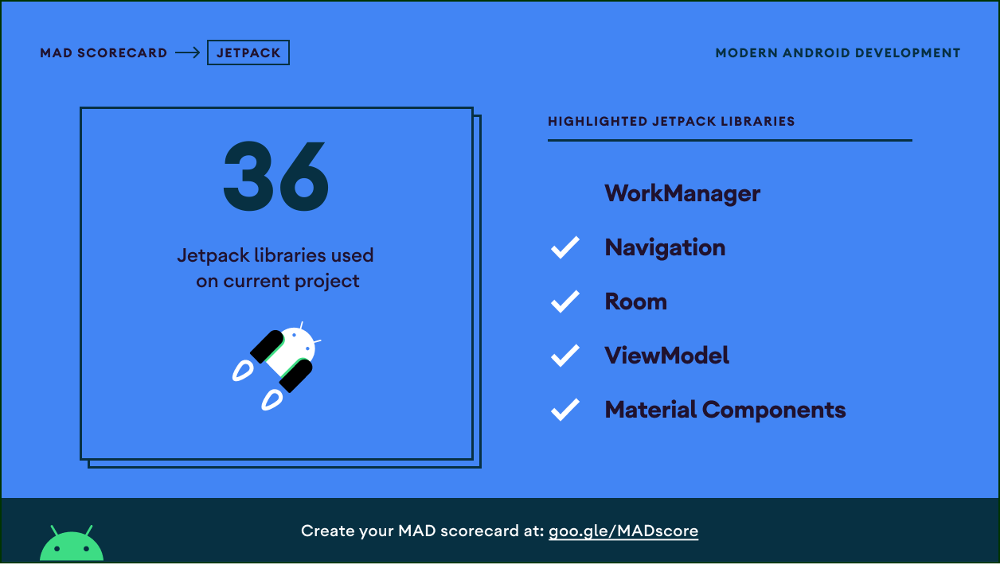

<h1 align="center">Github User</h1>

<p align="center">Github User is application for learning MAD (Modern Android Development)</p>

<p align="center">
  <a href="https://opensource.org/licenses/Apache-2.0"></a>
  <a href="https://android-arsenal.com/api?level=21"></a>
  <a href="https://github.com/onirutlA/github-user/actions"></a>
  <a href="https://github.com/onirutlA"></a> 
</p>

<h2 align="center">Onboarding Screen</h2>
<p align="center">
  
  
  
</p>

<h2 align="center">Bottom Navigation</h2>
<p align= "center">
  
  
  
  
  
</p>

<h2 align="center">Search, Detail And Favorite</h2>
<p align="center">
  
  
  
  
  
</p>

- [Kotlin](https://kotlinlang.org/) based, [Coroutines](https://github.com/Kotlin/kotlinx.coroutines) + [Flow](https://kotlin.github.io/kotlinx.coroutines/kotlinx-coroutines-core/kotlinx.coroutines.flow/) for asynchronous.
- [Hilt](https://dagger.dev/hilt/) for dependency injection.
- Jetpack
    - Lifecycle - dispose of observing data when lifecycle state changes.
    - ViewModel - UI related data holder, lifecycle aware.
    - Room Persistence - construct the database using the abstract layer.
    - Data Store - Persist user preference
    - Navigation Component - Navigate to another fragment
- Architecture
    - MVVM Architecture (View - DataBinding - ViewBinding - ViewModel - Model)
    - Repository pattern
- [Retrofit2 & OkHttp3](https://github.com/square/retrofit) - construct the REST APIs.
- [Moshi](https://github.com/square/moshi/) - A modern JSON library for Kotlin and Java.
- [Glide](https://github.com/bumptech/glide) - loading images.
- [Mockito](https://site.mockito.org) - mock dependencies for testing
- [Material-Components](https://github.com/material-components/material-components-android) - Material design components for building ripple animation, and CardView.

## Download
- Go To [Releases](https://github.com/onirutlA/MetalGearCharacters/releases) to download latest APK
- Download the .apk file
- Install on your phone

## Clone this repository

To clone this repository make sure you git is already installed on your device, then follow this command:
```git
git clone https://github.com/onirutlA/github-user.git
```

Or if you prefer SSH more than HTTPS then follow this command:
```git
git clone git@github.com:onirutlA/github-user.git
```

## MAD Score




## Architecture
Github User architecture is based on Google Recommendation MVVM and the Repository pattern.


## Support
> Become **Stargazer** for this repository at [Stargazers](https://github.com/onirutlA/github-user/stargazers) and **Follow** this github to support me

## Author
[**onirutlA**](https://www.linkedin.com/in/onirutla) - onirutlA@gmail.com

## LICENSE
```
Designed and Developed by Ricky "onirutlA" Alturino

Copyright 2021 Ricky "onirutlA" Alturino

   Licensed under the Apache License, Version 2.0 (the "License");
   you may not use this file except in compliance with the License.
   You may obtain a copy of the License at

       https://www.apache.org/licenses/LICENSE-2.0

   Unless required by applicable law or agreed to in writing, software
   distributed under the License is distributed on an "AS IS" BASIS,
   WITHOUT WARRANTIES OR CONDITIONS OF ANY KIND, either express or implied.
   See the License for the specific language governing permissions and
   limitations under the License.
```
